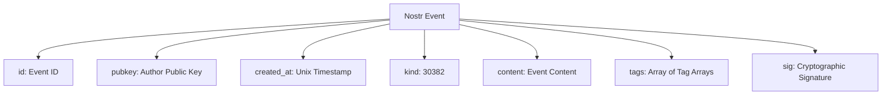
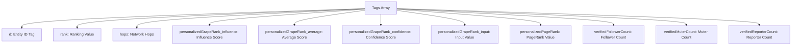
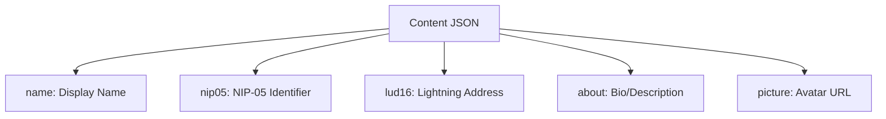
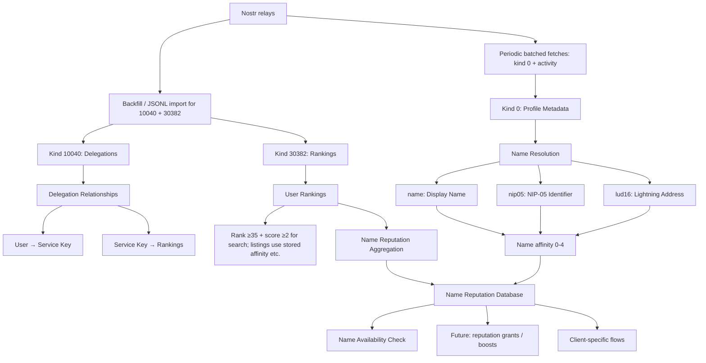
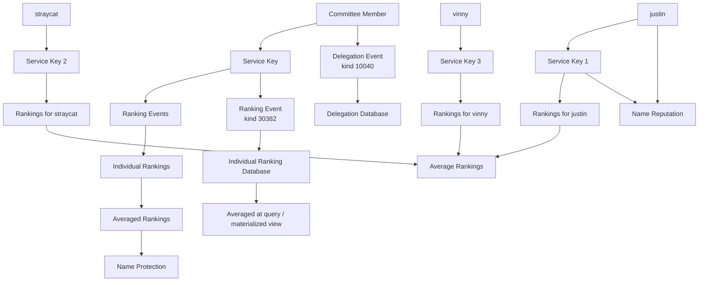

# NymRank Event Analysis

## Overview

This document analyzes the captured events from the Nostr relay `wss://nip85.brainstorm.world` for the **NymRank Name Reputation System**. The system uses these events to build a reputation database that warns users when trying to register names already used by high-reputation users. Profile metadata is fetched from additional relays.

**Event Types**:
- `kind:0` - Profile metadata (name, nip05, lud16 fields)
- `kind:10040` - Delegation events where users delegate to service keys
- `kind:30382` - Ranking events where metrics are stored in tags (not content)

## Registration outcomes (integrators)

The HTTP API exposes occupancy, `average_rank`, and `name_affinity`. Client apps usually map bands to copy:

- **Reserved** (`reserved_names`): table exists in `schema.sql`, but **`GET /api/names` does not query it** — implement reserved-name policy in the client or extend the server.
- **Occupied, rank ≥ 95**: strongest discouragement.
- **Occupied, rank 75–94**: strong discouragement.
- **Occupied, rank 35–74**: caution; weaker social resolution.
- **Below 35** or absent from rankings: often treated as low signal for protection; “available” flows are product-defined.

Search paths apply **rank ≥ 35** and a **per-query match score ≥ 2** (see `routes/web.js` and `services/aggregated-name-search.js`). Default name search (`aggregated-name-search.js`) also requires handle match via **`name` / `name` prefix** or **both** nip05 and lud16 equal to the query. **Perspective + search** uses a wider `WHERE` (name or nip05 or lud16) but the same scoring formula, so nip05+lud16 both matching without a `name` can still score 2+.

## Event Structure

### Basic Nostr Event Format


### Tag Structure Analysis (Kind 30382)


### Profile Metadata Structure (Kind 0)


## Event Categories for Name Reputation System

### 1. User Ranking Events (Kind 30382)
**Purpose**: User reputation rankings for name protection

**Key Tags**:
- `d`: User pubkey being ranked
- `rank`: Ranking value (100 = top tier, 98 = high tier)
- `hops`: Network distance (0, 1, 2)
- `personalizedGrapeRank_influence`: Influence score
- `personalizedGrapeRank_average`: Average score
- `personalizedGrapeRank_confidence`: Confidence level
- `personalizedGrapeRank_input`: Input value
- `personalizedPageRank`: PageRank algorithm result
- `verifiedFollowerCount`: Number of verified followers
- `verifiedMuterCount`: Number of verified muters
- `verifiedReporterCount`: Number of verified reporters

**Example**:
```json
{
  "content": "",
  "kind": 30382,
  "pubkey": "c7b05c6335d12e61940f48af8f6d45ec293db540806eecf3e51207aa82386617",
  "tags": [
    ["d", "e5272de914bd301755c439b88e6959a43c9d2664831f093c51e9c799a16a102f"],
    ["rank", "100"],
    ["hops", "0"],
    ["personalizedGrapeRank_influence", "1"],
    ["personalizedGrapeRank_average", "1"],
    ["personalizedGrapeRank_confidence", "1"],
    ["personalizedGrapeRank_input", "9999"],
    ["personalizedPageRank", "1"],
    ["verifiedFollowerCount", "1654"],
    ["verifiedMuterCount", "1"],
    ["verifiedReporterCount", "0"]
  ]
}
```

### 2. Delegation Events (Kind 10040)
**Purpose**: Committee members delegate to **service keys** that publish kind 30382 rankings.

**Key Tags** (see `parseDelegationEvent` in `services/event-processor.js`):
- First element: `30382:rank` or `30382:personalizedGrapeRank_*` (metric key)
- Second element: **Service pubkey** (signer of the corresponding 30382 events)
- Third element: Source relay URL

**Example**:
```json
{
  "content": "",
  "kind": 10040,
  "pubkey": "3316e3696de74d39959127b9d842df57bddc5d1c7af8a04f1bc7aed80b445088",
  "tags": [
    ["30382:rank", "48ec018359cac3c933f0f7a14550e36a4f683dcf55520c916dd8c61e7724f5de", "wss://nip85.brainstorm.world"],
    ["30382:personalizedGrapeRank_influence", "48ec018359cac3c933f0f7a14550e36a4f683dcf55520c916dd8c61e7724f5de", "wss://nip85.brainstorm.world"]
  ]
}
```

### 3. Profile Metadata Events (Kind 0)
**Purpose**: User profile information for name resolution

**Content Fields**:
- `name`: Display name
- `nip05`: NIP-05 identifier (name@domain.com)
- `lud16`: Lightning address (name@domain.com)
- `about`: Bio/description
- `picture`: Avatar URL

**Example**:
```json
{
  "content": "{\"name\":\"alice\",\"nip05\":\"alice@domain.com\",\"lud16\":\"alice@lightning.com\",\"about\":\"Developer\"}",
  "kind": 0,
  "pubkey": "e5272de914bd301755c439b88e6959a43c9d2664831f093c51e9c799a16a102f"
}
```

## Name Reputation Data Flow



## Key Patterns for Name Reputation

### 1. Rank Distribution
- **95+**: Elite users (very high protection)
- **85-95**: Average influencers (high protection) 
- **75-85**: Professionals (moderate protection)
- **45-75**: Legitimate users (basic protection, need unique names)
- **35-45**: Not bots (minimal protection)
- **Below 35**: Filtered out of name search / default lists (`MIN_RANK_VALUE`)

### 2. Name Affinity System
Stored column `user_names.name_affinity` is computed in `insertUserName` (`services/database.js`):

- **`name`**: +2 if the field is non-empty after sanitization
- **`nip05`**: +1 if present (local part before `@` is stored)
- **`lud16`**: +1 if present (local part before `@` is stored)
- **Total**: 0–4

Whether a user **matches** a searched handle depends on the code path:

- **Default search** (no committee perspective): `services/aggregated-name-search.js` — row must match `name` exactly, `name` as `"query …"` prefix, **or** **both** `nip05` and `lud16` equal to the query; then the SQL `HAVING` clause requires the same score formula **≥ 2**.
- **Search + perspective**: `routes/web.js` — broader `WHERE` (name, nip05, or lud16 match); same +2/+1 score; **≥ 2** to pass.

NIP-05 identifiers are **not** DNS-verified here.

**Worked examples (stored column)**:
- `name="jack"` only → **2**
- `name="jack"` + `nip05="jack@domain.com"` → **3**
- All three fields aligned on `jack` → **4**
- Only `lud16="jack@random.com"` (no `name`, no `nip05`) → **1**

**Username extraction** (kind 0 parsing in `event-processor.js`):
- `nip05="alice@domain.com"` → stored local part `alice`
- `lud16="bob@lightning.com"` → stored local part `bob`

**Name occupation rules (conceptual)**:
- Default search requires enough points under the **SQL** score (minimum **2** in `HAVING`) **and** the stricter `WHERE` in `aggregated-name-search.js`
- Under **default** search, a lone nip05 or lud16 cannot match (both nip05 and lud16 must equal the query for the nip05/lud16 path). **Perspective + search** can match with nip05+lud16 only if both equal the query (score 2)
- Users can match **multiple** handles when `name` and nip05/lud16 locals disagree (see below)

**Edge case — two handles on one pubkey**:
- `name="jake"` + `nip05="jack@…"` + `lud16="jack@…"` can match searches for **jake** (via `name`) and **jack** (via nip05/lud16 when both equal the query)

### 3. Committee-Based Delegation Chain


### 4. Name Protection Logic (heuristic)

For **listings** and **occupied-nym counts**, the code uses **stored** `user_names.name_affinity` (0–4) and **rank ≥ 35**. For **search**, it uses the **per-query** score in SQL (same +2/+1 weights) with **≥ 2**, plus path-specific `WHERE` clauses as above.

- **High rank + stored affinity 3–4**: Strong signal
- **High rank + stored affinity 2**: Moderate signal
- **Stored affinity 0–1**: Excluded from occupied-nym counts; search usually will not return a row
- **Rank below 35**: Excluded from typical search/list paths

## Data Quality Observations

### 1. Rank Distribution
- **Rank 100 / 98**: Common among high-reputation users in observed relay data
- **Below rank 35**: Excluded from aggregated name search and most list queries (`MIN_RANK_VALUE = 35`)

### 2. Name Affinity Distribution
- **Affinity 4**: Users with all three name fields (name, nip05, lud16)
- **Affinity 3**: Users with name + one additional field
- **Affinity 2**: Users with name field only
- **Affinity 1**: Users with only nip05 or lud16 (no name occupation)
- **Affinity 0**: Users with no name fields (ranked but no names)

### 3. Network Analysis
The hops system (0, 1, 2) indicates network distance for influence calculation:
- **Hops 0**: Direct connections (highest influence)
- **Hops 1**: One-degree connections
- **Hops 2**: Two-degree connections

### 4. Processing model (this codebase)

- **Kind 10040 / 30382**: Loaded via **`backfill-attestations.js`** and/or JSONL importers (`import-jsonl.js`, etc.) from ranking relays — **not** on a timer inside `RelayListener`. `DelegationHandler` / `RankingHandler` use `fetchLatestEvents` but are **not called** from `RelayListener.start()` today.
- **Social relays** (`SOCIAL_RELAY_URLS`, defaults in `services/config.js`): Kind **0** and **activity** checks use **batched** `fetchLatestEvents` with cooldowns (README: **Background activity checks**); see `ProfileHandler` and `relay-listener.js` periodic loop.
- **Ingestion**: Parsed **30382** rows are stored without a minimum rank filter; **search** and most listings apply **rank ≥ 35** where documented.
- **Serving**: List/UI/API read **PostgreSQL**; relay calls are for refresh only.

## See also

- **[README.md](./README.md)** — setup, env vars, API list, activity scheduler
- **[schema.sql](./schema.sql)** — authoritative DDL

## Conclusion

NymRank combines committee-sourced rankings (10040 → 30382) with profile metadata (kind 0) to reason about name occupancy. **Stored affinity** (0–4) feeds listing counts; **search** uses query-time scores in `aggregated-name-search.js` (default) and `routes/web.js` (perspective), with **rank ≥ 35** on search paths. Default **browse** lists are not rank-filtered in SQL. Client apps map average rank to UX using the registration outcome bands in the README.
