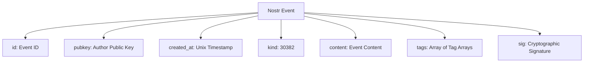
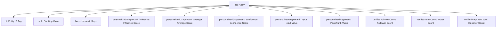
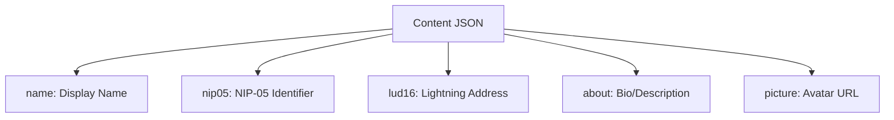
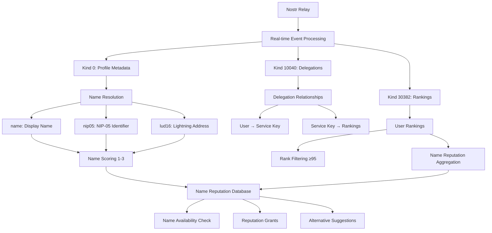
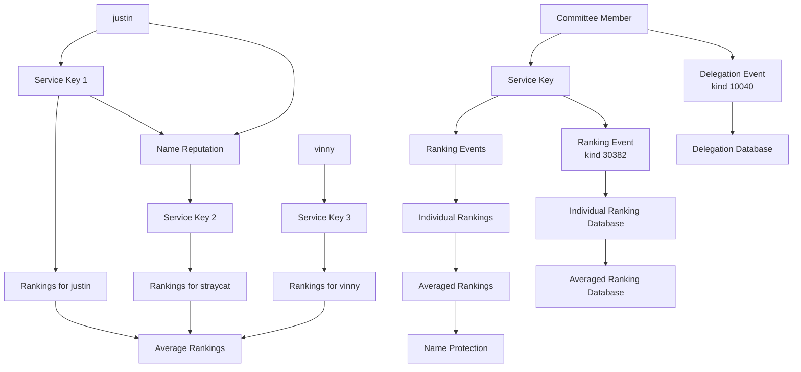

# NymRank Event Analysis

## Overview

This document analyzes the captured events from the Nostr relay `wss://nip85.brainstorm.world` for the **NymRank Name Reputation System**. The system uses these events to build a reputation database that warns users when trying to register names already used by high-reputation users. Profile metadata is fetched from additional relays.

**Event Types**:
- `kind:0` - Profile metadata (name, nip05, lud16 fields)
- `kind:10040` - Delegation events where users delegate to service keys
- `kind:30382` - Ranking events where metrics are stored in tags (not content)

## Event Structure

### Basic Nostr Event Format


### Tag Structure Analysis (Kind 30382)


### Profile Metadata Structure (Kind 0)


## Event Categories for Name Reputation System

### 1. User Ranking Events (Kind 30382)
**Purpose**: User reputation rankings for name protection

**Key Tags**:
- `d`: User pubkey being ranked
- `rank`: Ranking value (100 = top tier, 98 = high tier)
- `hops`: Network distance (0, 1, 2)
- `personalizedGrapeRank_influence`: Influence score
- `personalizedGrapeRank_average`: Average score
- `personalizedGrapeRank_confidence`: Confidence level
- `personalizedGrapeRank_input`: Input value
- `personalizedPageRank`: PageRank algorithm result
- `verifiedFollowerCount`: Number of verified followers
- `verifiedMuterCount`: Number of verified muters
- `verifiedReporterCount`: Number of verified reporters

**Example**:
```json
{
  "content": "",
  "kind": 30382,
  "pubkey": "c7b05c6335d12e61940f48af8f6d45ec293db540806eecf3e51207aa82386617",
  "tags": [
    ["d", "e5272de914bd301755c439b88e6959a43c9d2664831f093c51e9c799a16a102f"],
    ["rank", "100"],
    ["hops", "0"],
    ["personalizedGrapeRank_influence", "1"],
    ["personalizedGrapeRank_average", "1"],
    ["personalizedGrapeRank_confidence", "1"],
    ["personalizedGrapeRank_input", "9999"],
    ["personalizedPageRank", "1"],
    ["verifiedFollowerCount", "1654"],
    ["verifiedMuterCount", "1"],
    ["verifiedReporterCount", "0"]
  ]
}
```

### 2. Delegation Events (Kind 10040)
**Purpose**: Users delegate to service keys for ranking

**Key Tags**:
- `30382:rank`: Delegation for rank metric
- `30382:personalizedGrapeRank_*`: Delegation for specific metrics
- Second tag: User pubkey being ranked
- Third tag: Source relay

**Example**:
```json
{
  "content": "",
  "kind": 10040,
  "pubkey": "3316e3696de74d39959127b9d842df57bddc5d1c7af8a04f1bc7aed80b445088",
  "tags": [
    ["30382:rank", "48ec018359cac3c933f0f7a14550e36a4f683dcf55520c916dd8c61e7724f5de", "wss://nip85.brainstorm.world"],
    ["30382:personalizedGrapeRank_influence", "48ec018359cac3c933f0f7a14550e36a4f683dcf55520c916dd8c61e7724f5de", "wss://nip85.brainstorm.world"]
  ]
}
```

### 3. Profile Metadata Events (Kind 0)
**Purpose**: User profile information for name resolution

**Content Fields**:
- `name`: Display name
- `nip05`: NIP-05 identifier (name@domain.com)
- `lud16`: Lightning address (name@domain.com)
- `about`: Bio/description
- `picture`: Avatar URL

**Example**:
```json
{
  "content": "{\"name\":\"alice\",\"nip05\":\"alice@domain.com\",\"lud16\":\"alice@lightning.com\",\"about\":\"Developer\"}",
  "kind": 0,
  "pubkey": "e5272de914bd301755c439b88e6959a43c9d2664831f093c51e9c799a16a102f"
}
```

## Name Reputation Data Flow



## Key Patterns for Name Reputation

### 1. Rank Distribution
- **95+**: Elite users (very high protection)
- **85-95**: Average influencers (high protection) 
- **75-85**: Professionals (moderate protection)
- **45-75**: Legitimate users (basic protection, need unique names)
- **35-45**: Not bots (minimal protection)
- **<35**: Filtered out (likely bots/inactive)

### 2. Name Affinity System
Based on profile metadata fields:
- **`name` field**: 2 points (primary identifier)
- **`nip05` username prefix**: 1 point (extract "user" from "user@domain.com")
- **`lud16` username prefix**: 1 point (extract "user" from "user@domain.com")
- **Total**: 0-4 points

**Username Extraction**:
- `nip05="alice@domain.com"` → extract "alice" for name occupation
- `lud16="bob@lightning.com"` → extract "bob" for name occupation
- Only the username prefix is used for name protection, not the full identifier

**Name Occupation Rules**:
- Only occupy names with affinity ≥ 2
- Prevents random lud16/nip05 from triggering occupation
- Allows users to occupy multiple names if they have sufficient affinity for each
- Breaks ties when users have identical ranks

**Name Validation**:
- `name` field must be a valid slug (alphanumeric, hyphens, underscores only)
- Invalid names like "First Last" (with spaces) are disregarded
- Only valid slug-formatted names contribute to affinity scoring

**Edge Case - Multiple Name Occupation**:
- User with `name="jake"` + `nip05="jack@domain.com"` + `lud16="jack@lightning.com"`: 
  - Affinity for "jake" = 2 ✅ (occupies "jake" via name field)
  - Affinity for "jack" = 2 ✅ (occupies "jack" via nip05/lud16 username prefixes)
  - **Result**: User occupies both "jake" and "jack" names
- User with `name="First Last"` (invalid slug): affinity = 0 ❌ (name field disregarded)

### 3. Committee-Based Delegation Chain


### 4. Name Protection Logic
- **High Rank + High Name Affinity (3-4)**: Strong protection
- **High Rank + Medium Name Affinity (2)**: Moderate protection
- **High Rank + Low Name Affinity (0-1)**: No protection (affinity too low)
- **Low Rank**: No protection (filtered out)

## Data Quality Observations

### 1. Rank Distribution
- **Rank 100**: Top tier users (most common in high-reputation users)
- **Rank 98**: High tier users (second most common)
- **Rank <95**: Filtered out for name protection purposes

### 2. Name Affinity Distribution
- **Affinity 4**: Users with all three name fields (name, nip05, lud16)
- **Affinity 3**: Users with name + one additional field
- **Affinity 2**: Users with name field only
- **Affinity 1**: Users with only nip05 or lud16 (no name occupation)
- **Affinity 0**: Users with no name fields (ranked but no names)

### 3. Network Analysis
The hops system (0, 1, 2) indicates network distance for influence calculation:
- **Hops 0**: Direct connections (highest influence)
- **Hops 1**: One-degree connections
- **Hops 2**: Two-degree connections

### 4. Event Processing Requirements
- **Real-time processing**: Events arrive continuously, no batching
- **Filtering**: Only process events with rank ≥95
- **Resilience**: Serve cached data when relay is down

## Next Steps

1. **Database Schema**: Implement the computed aggregation tables
2. **Real-time Processing**: Build continuous event processing pipeline
3. **Name Resolution**: Implement profile metadata ingestion (kind 0)
4. **API Development**: Build name reputation endpoints
5. **Reputation Grants**: Implement follow mechanism for name protection

## Conclusion

The NymRank system uses Nostr events to build a name reputation database that protects high-reputation users' names. Key features:

- **Real-time Processing**: Continuous event processing from relay
- **Name Protection**: Warn users when trying to register protected names
- **Reputation Grants**: Provide reputation boost for available names
- **Name Affinity**: 1-4 points based on profile completeness (name=2, nip05=1, lud16=1)
- **Rank Filtering**: Only consider users with rank ≥95 for protection

This system enables social apps to make informed decisions about name registration, protecting established users while helping new users find available names.
